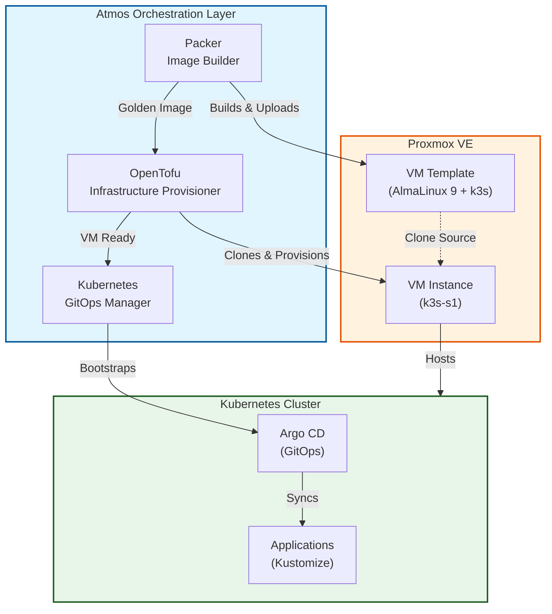

<div align="center">


# Homelab Infrastructure Automation

**Production-grade Infrastructure-as-Code demonstrating modern DevOps practices**

[](LICENSE)
[](https://opentofu.org/)
[](https://k3s.io/)
[](https://atmos.tools)
[](https://www.packer.io/)

</div>

---

## Overview

This repository showcases a complete infrastructure automation solution built from the ground up, demonstrating proficiency in:

- **Infrastructure as Code**: Declarative infrastructure management using OpenTofu (Terraform)
- **Image Building**: Automated VM image creation with HashiCorp Packer
- **Container Orchestration**: Kubernetes (k3s) cluster management
- **GitOps**: Application deployment using Argo CD
- **Orchestration**: Multi-tool workflow automation with Atmos
- **Virtualization**: Proxmox VE integration

The project implements a complete CI/CD-ready infrastructure stack that can provision a Kubernetes cluster from bare metal to running applications with a single command.

## 🏗️ Architecture



## ✨ Key Features

### 🔧 Infrastructure as Code

- **OpenTofu/Terraform**: Declarative VM provisioning on Proxmox
- **Modular Design**: Reusable components with stack-based configuration
- **State Management**: Remote state with locking and encryption
- **Idempotent Operations**: Safe to run repeatedly

### 📦 Automated Image Building

- **Golden Images**: Pre-baked VM templates with k3s installed
- **Packer Integration**: Automated AlmaLinux 9 image creation
- **Version Control**: Semantic versioning for image releases
- **Fast Deployments**: VMs boot with Kubernetes ready to use

### ☸️ Kubernetes & GitOps

- **k3s**: Lightweight Kubernetes distribution optimized for edge/homelab
- **Argo CD**: GitOps continuous delivery for Kubernetes
- **Kustomize**: Native Kubernetes configuration management
- **App-of-Apps Pattern**: Declarative application deployment

### 🎼 Orchestration with Atmos

- **Unified Interface**: Single tool to manage Packer, OpenTofu, and Kubernetes
- **Stack Management**: Environment configurations with inheritance
- **Workflow Automation**: End-to-end deployment workflows
- **Configuration Validation**: Pre-deployment validation and inspection

## 🚀 Quick Start

### Prerequisites

- [Atmos](https://atmos.tools/install) - Infrastructure orchestration
- [OpenTofu](https://opentofu.org) or Terraform - Infrastructure provisioning
- [Packer](https://www.packer.io) - Image building
- [kubectl](https://kubernetes.io/docs/tasks/tools/) - Kubernetes CLI
- Proxmox VE server with API access

### Deploy Complete Stack

```bash
# 1. Validate configuration
atmos validate stacks

# 2. Run end-to-end deployment
atmos workflow deploy-homelab -f stacks/workflows/deploy.yaml
```

This single workflow:

1. Builds a k3s-optimized AlmaLinux 9 image with Packer
2. Provisions a VM on Proxmox with OpenTofu
3. Bootstraps Kubernetes with Argo CD
4. Deploys applications via GitOps

### Individual Operations

```bash
# Build VM image
atmos packer build alma9-k3s-optimized -s pve-prod

# Deploy infrastructure
atmos terraform apply k3s-cluster -s pve-prod

# Bootstrap Kubernetes
kubectl apply -k k8s/clusters/home/bootstrap
```

## 📁 Repository Structure

```
homelab/
├── components/              # Reusable infrastructure components
│   ├── terraform/          # OpenTofu root modules
│   │   └── k3s-cluster/   # Kubernetes cluster component
│   └── packer/            # Packer templates
│       └── alma9-k3s-optimized/  # AlmaLinux + k3s image
├── stacks/                 # Environment configurations
│   ├── catalog/           # Reusable base configs
│   ├── deploy/            # Deployment stacks (pve-prod)
│   └── workflows/         # Automation workflows
├── k8s/                   # Kubernetes manifests
│   ├── argo/             # Argo CD app-of-apps
│   └── clusters/home/    # Cluster configurations
│       ├── bootstrap/    # Argo CD installation
│       ├── infra/        # Infrastructure apps
│       └── apps/         # User applications
└── .kiro/specs/          # Feature specifications
    ├── homelab-infra/    # Initial infrastructure spec
    └── atmos-integration/ # Atmos orchestration spec
```

## 🛠️ Technologies & Tools

### Infrastructure & Virtualization

- **Proxmox VE** - Open-source virtualization platform
- **OpenTofu** - Open-source Terraform alternative
- **Packer** - Automated machine image creation
- **Cloud-init** - VM initialization and configuration

### Container & Orchestration

- **k3s** - Lightweight Kubernetes distribution
- **Kubernetes** - Container orchestration platform
- **Argo CD** - GitOps continuous delivery
- **Kustomize** - Kubernetes native configuration management

### Automation & Tooling

- **Atmos** - Universal DevOps orchestration tool
- **Make** - Build automation
- **Bash** - Shell scripting
- **Git** - Version control

### Operating Systems

- **AlmaLinux 9** - RHEL-compatible Linux distribution
- **UEFI Boot** - Modern firmware interface

## 📚 Learning & Development

This project demonstrates:

### DevOps Practices

- Infrastructure as Code (IaC)
- GitOps workflows
- Declarative configuration management
- Immutable infrastructure
- Configuration validation and testing

### Software Engineering

- Modular, reusable component design
- Separation of concerns
- DRY (Don't Repeat Yourself) principles
- Documentation-driven development
- Specification-driven implementation

### Cloud-Native Technologies

- Container orchestration
- Service mesh concepts
- Cloud-init and VM automation
- API-driven infrastructure management

## 🎓 Spec-Driven Development

This project uses a formal specification process to ensure quality and maintainability:

### Specifications

Each major feature has a complete spec in `.kiro/specs/` including:

- **Requirements**: User stories with EARS-compliant acceptance criteria
- **Design**: Architecture, components, data models, and correctness properties
- **Tasks**: Implementation plan with property-based testing

### Current Specs

1. **homelab-infra**: Base infrastructure with Packer, OpenTofu, and Kubernetes
2. **atmos-integration**: Orchestration layer with Atmos

This approach demonstrates:

- Requirements engineering
- System design and architecture
- Test-driven development mindset
- Documentation best practices

## 🔍 Use Cases

### Personal Learning

- Hands-on experience with production-grade tools
- Understanding of infrastructure automation
- Kubernetes and GitOps workflows
- Multi-tool orchestration

### Homelab Applications

- Self-hosted services (media servers, home automation, etc.)
- Development and testing environments
- Learning platform for new technologies
- Portfolio demonstration

### Professional Skills

- Infrastructure automation
- Cloud-native technologies
- DevOps tooling and practices
- System architecture and design

## 🚧 Roadmap

- [ ] Multi-node Kubernetes cluster support
- [ ] Monitoring stack (Prometheus, Grafana)
- [ ] Secrets management (Sealed Secrets, External Secrets)
- [ ] Service mesh (Istio/Linkerd)
- [ ] Backup and disaster recovery automation
- [ ] CI/CD pipeline integration
- [ ] Multi-environment support (dev, staging, prod)

## 📖 Documentation

- [Homelab Infrastructure Spec](.kiro/specs/homelab-infra/) - Initial infrastructure design
- [Atmos Integration Spec](.kiro/specs/atmos-integration/) - Orchestration layer design
- [Atmos Usage Guide](.kiro/specs/atmos-integration/README.md) - Detailed usage instructions

## 🤝 Contributing

This is a personal learning project, but feedback and suggestions are welcome! Feel free to:

- Open issues for questions or suggestions
- Submit pull requests for improvements
- Share your own homelab experiences

## 📝 License

This project is open source and available under the [MIT License](LICENSE).

## 👤 About

This project is maintained as a learning exercise and portfolio piece, demonstrating practical experience with modern DevOps tools and practices. It represents real-world infrastructure automation patterns adapted for a homelab environment.

---

**Built with** ❤️ **and a lot of YAML**
