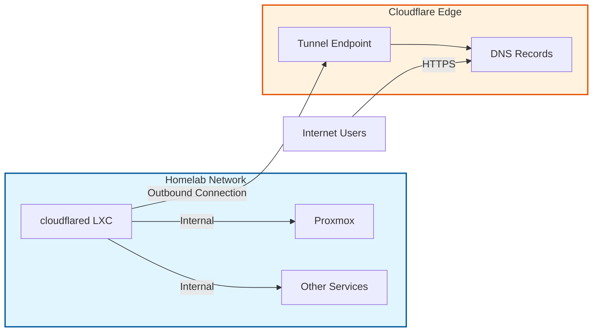

# Cloudflare Integration

Cloudflare provides secure external access to homelab services through Cloudflare Tunnels.

## Overview

Cloudflare Tunnels create a secure, outbound-only connection from your infrastructure to Cloudflare's edge network, eliminating the need to:

- Open inbound ports on your firewall
- Expose your home IP address
- Manage SSL certificates manually

## Components

### cloudflared LXC

A lightweight LXC container running the `cloudflared` daemon that:

- Establishes persistent tunnel connections to Cloudflare
- Routes incoming requests to internal services
- Handles TLS termination and authentication

### Terraform Environment

The `terraform/envs/cloudflared_lxc/` environment automates:

- Provisioning the LXC container on Proxmox
- Creating Cloudflare tunnel and DNS records
- Generating configuration files

## Benefits

!!! success "Security"
    - No exposed ports or public IP
    - Built-in DDoS protection
    - Zero Trust access control (optional)

!!! success "Simplicity"
    - Automatic SSL certificates
    - Single point of configuration
    - Infrastructure as Code

!!! success "Performance"
    - Global edge network
    - Automatic routing optimization
    - Built-in caching

## Next Steps

- [cloudflared LXC](cloudflared-lxc.md) - Deploy the cloudflared LXC container
