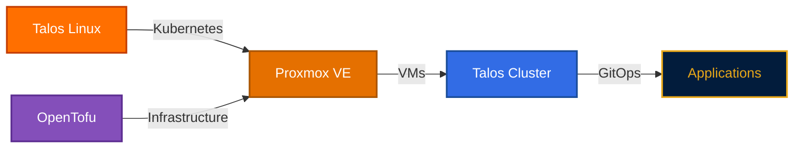

# Welcome to Homelab

A production-grade infrastructure automation project demonstrating modern DevOps practices and cloud-native technologies.

## What is This?

This homelab showcases end-to-end infrastructure automation—from building VM images to deploying Kubernetes applications—all orchestrated through code.



## The Stack

!!! tip "Infrastructure as Code"
**Proxmox VE** hosts everything. **Talos Linux** provides immutable Kubernetes. **OpenTofu** provisions VMs and configures clusters. **Argo CD** deploys apps.

## Quick Start

Deploy the entire stack with a single command:

```bash
atmos workflow deploy-homelab -f stacks/workflows/deploy.yaml
```

## Explore the Stack

### :material-server: [Proxmox](proxmox/index.md)

Open-source virtualization platform hosting all infrastructure

### :material-terraform: [OpenTofu](opentofu/index.md)

Infrastructure-as-code for declarative VM provisioning and cluster configuration

### :material-kubernetes: [Talos](talos/index.md)

Immutable, API-managed Kubernetes OS with production-grade security

### :material-kubernetes: [Kubernetes](k3s/index.md)

Production Kubernetes cluster with GitOps workflows

---

**Built with** ❤️ **and a lot of YAML**
