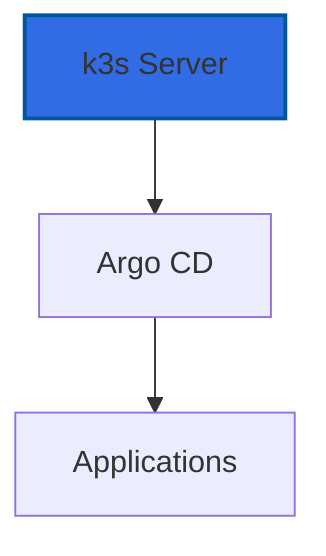

# K3s Kubernetes

K3s is a lightweight Kubernetes distribution designed for edge computing and resource-constrained environments.

## Overview

K3s powers the container orchestration in the homelab:

- **Lightweight**: Minimal resource footprint
- **Production-Ready**: Full Kubernetes API compatibility
- **GitOps**: Argo CD for application deployment
- **Easy Management**: Single binary installation

## Cluster Architecture

## Features

- Pre-installed in golden images
- Automatic startup on boot
- Traefik ingress disabled (custom ingress)
- GitOps-ready with Argo CD

## Next Steps

- [Cluster Setup](cluster.md) - Configure the cluster
- [GitOps](gitops.md) - Deploy with Argo CD
