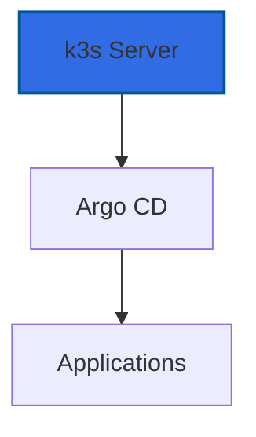

# K3s Kubernetes

K3s is a lightweight Kubernetes distribution designed for edge computing and resource-constrained environments.

## Overview

K3s powers the container orchestration in the homelab:

- **Lightweight**: Minimal resource footprint
- **Production-Ready**: Full Kubernetes API compatibility
- **GitOps**: Argo CD for application deployment
- **Easy Management**: Single binary installation

## Why k3s is Baked into the Image

We pre-install k3s during image building because:

| Benefit | Description |
|---------|-------------|
| **Fast Boot** | VMs start with Kubernetes already running |
| **Consistency** | Every deployment uses the exact same k3s version |
| **No Network Dependency** | No need to download k3s at runtime |
| **Atomic Updates** | Update k3s by building a new image |

### k3s Installation Flags

```bash
k3s server \
  --disable traefik \           # Use custom ingress controller
  --write-kubeconfig-mode 644   # Allow non-root kubeconfig access
```

### Alternative: Cloud-init Installation

If you need different k3s versions per VM, you can install via cloud-init:

```yaml
#cloud-config
runcmd:
  - curl -sfL https://get.k3s.io | INSTALL_K3S_VERSION=v1.29.0+k3s1 sh -
```

This approach trades boot speed for flexibility.

## Cluster Architecture



## Features

- Pre-installed in golden images
- Automatic startup on boot
- Traefik ingress disabled (custom ingress)
- GitOps-ready with Argo CD

## Next Steps

- [Cluster Setup](cluster.md) - Configure the cluster
- [GitOps](gitops.md) - Deploy with Argo CD
