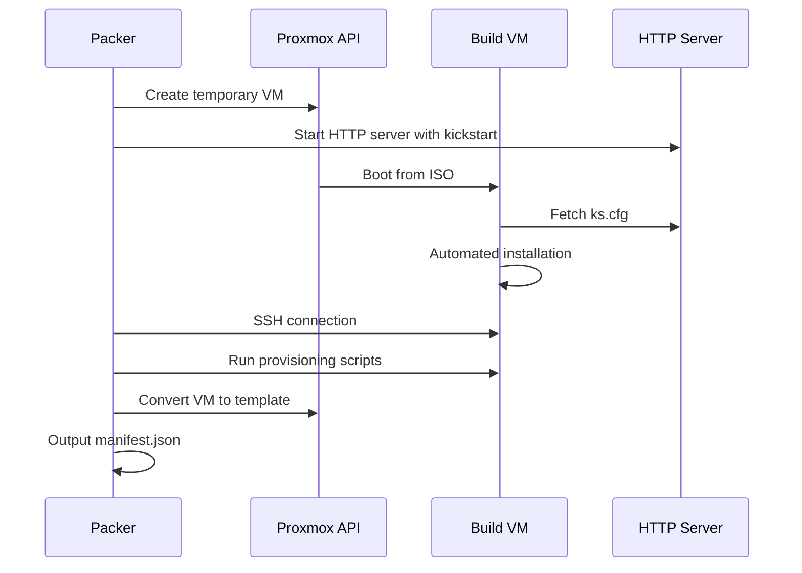

# Building Images

This guide covers how to build k3s-optimized AlmaLinux 9 golden images using Packer.

## Why Build Golden Images?

Building k3s into the image provides significant advantages:

- **Faster Boot**: VMs start with Kubernetes already running
- **Consistency**: Every VM uses the identical k3s version
- **Reduced Provisioning Time**: No network download or installation at runtime
- **Atomic Updates**: Create new images to update k3s, then roll out

## Build Process Overview



## Network Requirements

⚠️ **IMPORTANT**: Packer builds must be executed from inside your network with direct access to the Proxmox server's internal IP address.

The public Proxmox endpoint (`https://proxmox.chriswagner.dev`) is protected by Cloudflare Access with security policies (GitHub login required, country restrictions, etc.) that will block API token authentication. Packer cannot authenticate through these access controls.

**Run builds from:**

- A machine on the same network as Proxmox
- Via VPN connection to your homelab network
- From a bastion/jump host inside the network

**Configuration:**

- ✅ Use internal IP: `https://10.23.45.10:8006/api2/json`
- ❌ Do NOT use: `https://proxmox.chriswagner.dev/api2/json`

## Quick Start

### 1. Initialize Packer

```bash
cd packer/alma9-k3s-optimized
packer init .
```

### 2. Configure Variables

Create a `variables.auto.pkrvars.hcl` file:

```hcl
# Proxmox connection
proxmox_url      = "https://10.23.45.10:8006/api2/json"
proxmox_username = "root@pam"
proxmox_node     = "pve"

# ISO (use local path for faster builds)
alma_iso_url = "local:iso/AlmaLinux-9.3-x86_64-minimal.iso"
alma_iso_checksum = "sha256:..."

# Versions
k3s_version   = "v1.28.5+k3s1"
image_version = "alma9-k3-node-amd64-v1.28.5-v1"
```

### 3. Set Token (sensitive)

```bash
export PKR_VAR_proxmox_token="your-api-token-secret"
```

### 4. Validate Configuration

```bash
packer validate .
```

### 5. Build the Image

```bash
packer build .
```

Or use the Makefile:

```bash
make packer IMAGE_VERSION=alma9-k3-node-amd64-v1.28.5-v1
```

## Build Stages

The build runs these provisioning scripts in order:

| Stage | Script               | Purpose                                 |
| ----- | -------------------- | --------------------------------------- |
| 1     | `os-update.sh`       | System updates, timezone, base packages |
| 2     | `guest-agent.sh`     | Install QEMU guest agent                |
| 3     | `k3s-install.sh`     | Install k3s server, disable Traefik     |
| 4     | `hardening-oscap.sh` | Security hardening (stub)               |
| 5     | Cleanup              | Clear logs, machine-id for cloning      |

## Hardware Configuration

The builder VM uses these defaults:

| Setting | Value          | Configurable   |
| ------- | -------------- | -------------- |
| BIOS    | OVMF (UEFI)    | No             |
| Machine | q35            | No             |
| CPU     | 2 cores (host) | `vm_cores`     |
| Memory  | 4096 MB        | `vm_memory`    |
| Disk    | 32G SCSI       | `vm_disk_size` |
| Network | virtio         | `vm_bridge`    |

## Output

After a successful build:

1. **Template in Proxmox**: Named per `image_version` variable
2. **Manifest**: `manifest.json` with build metadata

```json
{
  "template_name": "alma9-k3-node-amd64-v1.28.5-v1",
  "k3s_version": "v1.28.5+k3s1",
  "build_time": "2024-01-15T10:30:00Z"
}
```

## Troubleshooting

### Build Hangs at Boot

- Check Proxmox console for boot errors
- Verify ISO is accessible
- Ensure kickstart is reachable (check firewall)

### SSH Connection Fails

- Verify kickstart installed SSH correctly
- Check password matches between kickstart and variables
- Increase `ssh_timeout` for slow networks

### Template Creation Fails

- Ensure `vm_id` is not already in use
- Verify storage pool has sufficient space
- Check Proxmox API permissions

## Next Steps

- [Templates](templates.md) - Customize the Packer configuration
- [Overview](index.md) - Return to Packer overview
