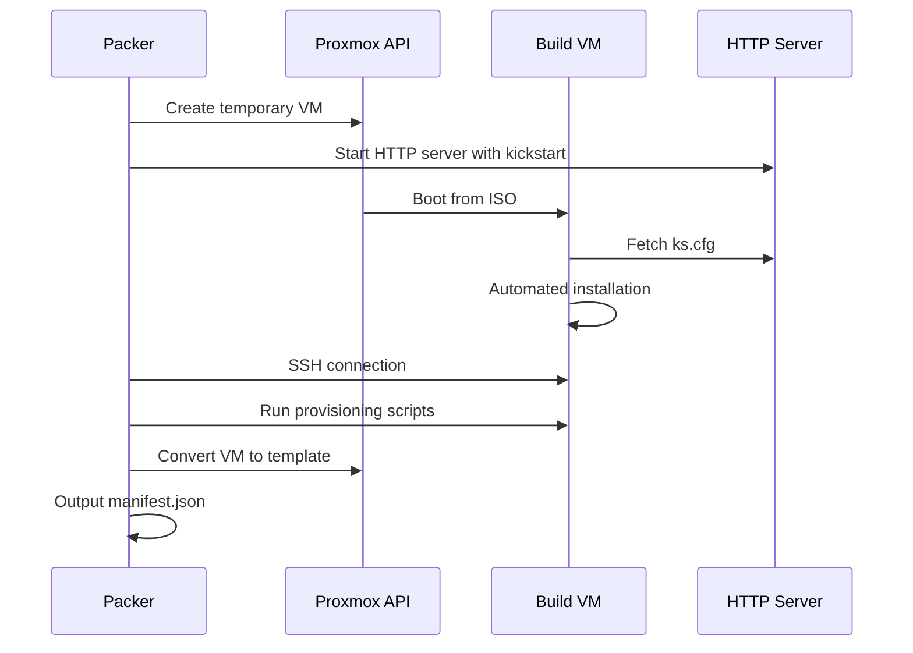

# Building Images

This guide covers how to build k3s-optimized AlmaLinux 9 golden images using Packer.

## Why Build Golden Images?

Building k3s into the image provides significant advantages:

- **Faster Boot**: VMs start with Kubernetes already running
- **Consistency**: Every VM uses the identical k3s version
- **Reduced Provisioning Time**: No network download or installation at runtime
- **Atomic Updates**: Create new images to update k3s, then roll out

## Build Process Overview



## Network Requirements

⚠️ **IMPORTANT**: Packer builds must be executed from inside your network with direct access to the Proxmox server's internal IP address.

The public Proxmox endpoint (`https://proxmox.chriswagner.dev`) is protected by Cloudflare Access with security policies (GitHub login required, country restrictions, etc.) that will block API token authentication. Packer cannot authenticate through these access controls.

**Run builds from:**

- A machine on the same network as Proxmox
- Via VPN connection to your homelab network
- From a bastion/jump host inside the network

**Configuration:**

- ✅ Use internal IP: `https://10.23.45.10:8006/api2/json`
- ❌ Do NOT use: `https://proxmox.chriswagner.dev/api2/json`

## Quick Start

### 1. Initialize Packer

```bash
cd packer/alma9-k3s-optimized
packer init .
```

### 2. Configure Variables

Create a `variables.auto.pkrvars.hcl` file:

```hcl
# Proxmox connection
proxmox_url      = "https://10.23.45.10:8006/api2/json"
proxmox_username = "root@pam"
proxmox_node     = "pve"

# ISO (use local path for faster builds)
alma_iso_url = "local:iso/AlmaLinux-9.3-x86_64-minimal.iso"
alma_iso_checksum = "sha256:..."

# Versions
k3s_version   = "v1.28.5+k3s1"
image_version = "alma9-k3-node-amd64-v1.28.5-v1"
```

### 3. Set API Token

Create or regenerate the Proxmox API token for Packer authentication.

**Create the packer user token** (in Proxmox shell):

```bash
pveum user token add packer@pve packer -privsep 0
```

**Or regenerate if it already exists:**

```bash
# Remove the old token
pveum user token remove packer@pve packer

# Create a new one
pveum user token add packer@pve packer -privsep 0
```

Copy the token output and export it as an environment variable:

```bash
export PKR_VAR_proxmox_token="packer@pve!packer=xxxxxxxx-xxxx-xxxx-xxxx-xxxxxxxxxxxx"
```

### 4. Validate Configuration

```bash
packer validate .
```

### 5. Build the Image

```bash
packer build .
```

Or use the Makefile:

```bash
make packer IMAGE_VERSION=alma9-k3-node-amd64-v1.28.5-v1
```

## Build Stages

The build runs these provisioning scripts in order:

| Stage | Script               | Purpose                                 |
| ----- | -------------------- | --------------------------------------- |
| 1     | `os-update.sh`       | System updates, timezone, base packages |
| 2     | `guest-agent.sh`     | Install QEMU guest agent                |
| 3     | `k3s-install.sh`     | Install k3s server, disable Traefik     |
| 4     | `hardening-oscap.sh` | Security hardening (stub)               |
| 5     | Cleanup              | Clear logs, machine-id for cloning      |

## Hardware Configuration

The builder VM uses these defaults:

| Setting | Value          | Configurable   |
| ------- | -------------- | -------------- |
| BIOS    | OVMF (UEFI)    | No             |
| Machine | q35            | No             |
| CPU     | 2 cores (host) | `vm_cores`     |
| Memory  | 4096 MB        | `vm_memory`    |
| Disk    | 32G SCSI       | `vm_disk_size` |
| Network | virtio         | `vm_bridge`    |

## Output

After a successful build:

1. **Template in Proxmox**: Named per template_name variable
2. **Manifest**: `manifest.json` with build metadata

```json
{
  "builds": [
    {
      "name": "proxmox-iso.alma9-k3s",
      "builder_type": "proxmox-iso",
      "build_time": 1733508754,
      "artifact_id": "100",
      "custom_data": {
        "template_name": "alma9.6-k3s-stable-202512061712",
        "alma_version": "9.6",
        "k3s_channel": "stable",
        "build_time": "2025-12-06T17:12:34Z"
      }
    }
  ],
  "last_run_uuid": "d1e4c8a7-b2f3-4c5e-8d9a-1234567890ab"
}
```

### Finding the Latest Template

The manifest file tracks all builds. To identify the latest template:

1. **`last_run_uuid`**: Matches the UUID of the most recent build
2. **Last in array**: The latest build is always the last element in the `builds` array
3. **`artifact_id`**: The Proxmox VM ID of the template (use this for Terraform's `clone_id`)

**Extract template ID for Terraform:**

```bash
# Get the artifact_id (VM ID) of the latest build
cat manifest.json | jq -r '.builds[-1].artifact_id'

# Get the template name
cat manifest.json | jq -r '.builds[-1].custom_data.template_name'
```

**Note**: Terraform requires the **VM ID (artifact_id)** as an integer, not the template name string.

## Troubleshooting

### Cannot Connect to Proxmox API

**Problem**: Packer fails to connect with authentication errors or timeouts.

**Cause**: The Cloudflare-protected public endpoint blocks API token authentication.

**Solution**: Use the Proxmox server's internal IP address:

```hcl
proxmox_url = "https://10.23.45.10:8006/api2/json"
```

**Important**: You must be on the internal network or connected via VPN to access this endpoint.

### TLS Certificate Verification Issues

**Problem**: When using the internal IP, you may encounter TLS certificate errors because the certificate is issued for the domain name (e.g., `proxmox.chriswagner.dev`), not the IP address.

**Solution Options**:

1. **Skip TLS verification** (not recommended for production):

   ```hcl
   insecure_skip_tls_verify = true
   ```

2. **Use the domain with correct routing**:
   - Ensure your VPN or internal DNS resolves the domain to the internal IP
   - Do NOT modify `/etc/hosts` to map the VPN domain to Proxmox's IP, as this will break VPN connectivity

**Common `/etc/hosts` pitfall**:

```bash
# ❌ DON'T DO THIS - breaks VPN connection
10.23.45.10 vpn.example.com

# This causes the VPN domain to resolve to Proxmox instead of the VPN server,
# preventing you from connecting to the VPN in the first place
```

**Correct approach**:

- Let the VPN handle DNS resolution naturally
- Use the internal IP directly with `insecure_skip_tls_verify = true` if needed
- Or configure internal DNS (Pi-hole, etc.) to resolve the Proxmox domain to its internal IP

### Build Hangs at Boot

- Check Proxmox console for boot errors
- Verify ISO is accessible
- Ensure kickstart is reachable (check firewall)

### SSH Connection Fails

- Verify kickstart installed SSH correctly
- Check password matches between kickstart and variables
- Increase `ssh_timeout` for slow networks

### Template Creation Fails

- Ensure `vm_id` is not already in use
- Verify storage pool has sufficient space
- Check Proxmox API permissions

## Next Steps

- [Templates](templates.md) - Customize the Packer configuration
- [Overview](index.md) - Return to Packer overview
