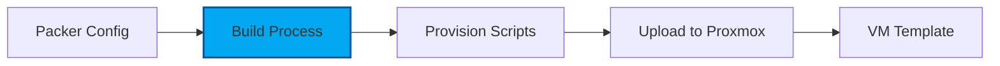

# Packer Image Building

HashiCorp Packer automates the creation of machine images for multiple platforms from a single source configuration.

## Overview

Packer builds golden images for the homelab:

- **AlmaLinux 9 Base**: RHEL-compatible Linux distribution
- **k3s Pre-installed**: Kubernetes ready on first boot
- **Automated Builds**: Reproducible image creation
- **Version Control**: Semantic versioning for images

## Why Packer?

Building images with Packer provides:

- **Reproducibility**: Same configuration = same image every time
- **Version Control**: Image definitions stored in Git
- **Automation**: No manual VM installation steps
- **Multi-Platform**: Same process works across hypervisors

## Image Pipeline

## Built Images

- **alma9-k3s-node-amd64**: AlmaLinux 9 with k3s server
- UEFI boot support
- QEMU guest agent pre-installed
- Cloud-init enabled

## Kickstart Automation

The image uses a **kickstart file** (`ks.cfg`) for unattended installation:

| Configuration | Setting |
|--------------|---------|
| Partitioning | GPT/LVM with XFS |
| Boot Mode | UEFI with EFI partition |
| Network | DHCP (static via cloud-init later) |
| SELinux | Enforcing |
| Timezone | UTC |
| Packages | Minimal + cloud-init + essential tools |

### Customizing the Kickstart

Edit `packer/alma9-k3s-optimized/http/ks.cfg` to:

- Change package selection in `%packages` section
- Modify partitioning layout
- Add custom post-install scripts in `%post` section

!!! tip "Root Password"
    The kickstart sets a temporary root password for Packer provisioning.
    This password is only used during build and VMs boot with cloud-init SSH keys.

## Security Hardening

The image includes a **stub script** for OpenSCAP-based security hardening:

### Available Profiles

| Profile | Description |
|---------|-------------|
| **STIG** | Security Technical Implementation Guide (DoD) |
| **CIS Level 1** | Center for Internet Security - basic server |
| **CIS Level 2** | Center for Internet Security - comprehensive |
| **OSPP** | Protection Profile for General Purpose OS |

### Enabling Hardening

Edit `packer/alma9-k3s-optimized/scripts/hardening-oscap.sh`:

1. Uncomment the OpenSCAP installation section
2. Choose your desired profile
3. Uncomment the remediation section

!!! warning "Test First"
    Security hardening can break functionality. Always test in a
    non-production environment before applying to production images.

### References

- [OpenSCAP Project](https://www.open-scap.org/)
- [SCAP Security Guide](https://github.com/ComplianceAsCode/content)
- [CIS Benchmarks](https://www.cisecurity.org/cis-benchmarks)

## Next Steps

- [Image Building](building.md) - Build your first image
- [Templates](templates.md) - Customize Packer templates
