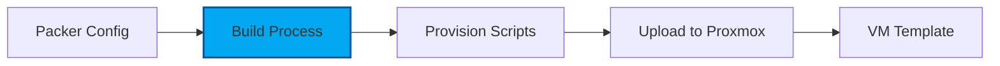

# Packer Image Building

HashiCorp Packer automates the creation of machine images for multiple platforms from a single source configuration.

## Overview

Packer builds golden images for the homelab:

- **AlmaLinux 9 Base**: RHEL-compatible Linux distribution
- **k3s Pre-installed**: Kubernetes ready on first boot
- **Automated Builds**: Reproducible image creation
- **Version Control**: Semantic versioning for images

## Image Pipeline

## Built Images

- **alma9-k3s-node-amd64**: AlmaLinux 9 with k3s server
- UEFI boot support
- QEMU guest agent pre-installed
- Cloud-init enabled

## Next Steps

- [Image Building](building.md) - Build your first image
- [Templates](templates.md) - Customize Packer templates
