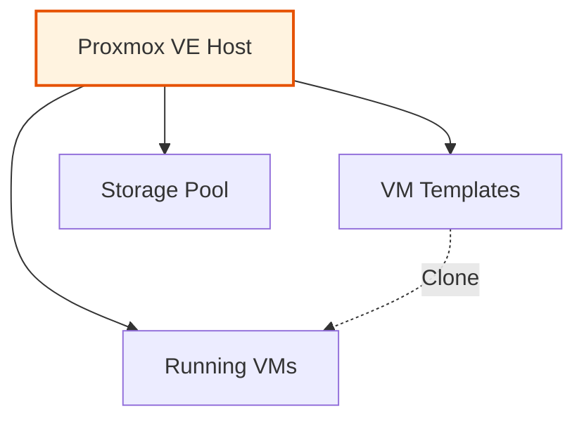

# Proxmox VE

Proxmox Virtual Environment is an open-source virtualization platform that combines KVM hypervisor and LXC containers.

## Overview

In this homelab, Proxmox VE serves as the foundation for all infrastructure:

- **Virtualization Platform**: Hosts all VMs including the k3s cluster
- **API Integration**: Automated VM provisioning via OpenTofu
- **Template Storage**: Stores golden images built by Packer
- **Resource Management**: Manages compute, storage, and networking

## Key Features

- Web-based management interface
- RESTful API for automation
- High availability clustering support
- Integrated backup and restore
- Software-defined networking

## Architecture

## Next Steps

- [Setup Guide](setup.md) - Configure Proxmox for the homelab
- [Configuration](configuration.md) - API tokens and networking
