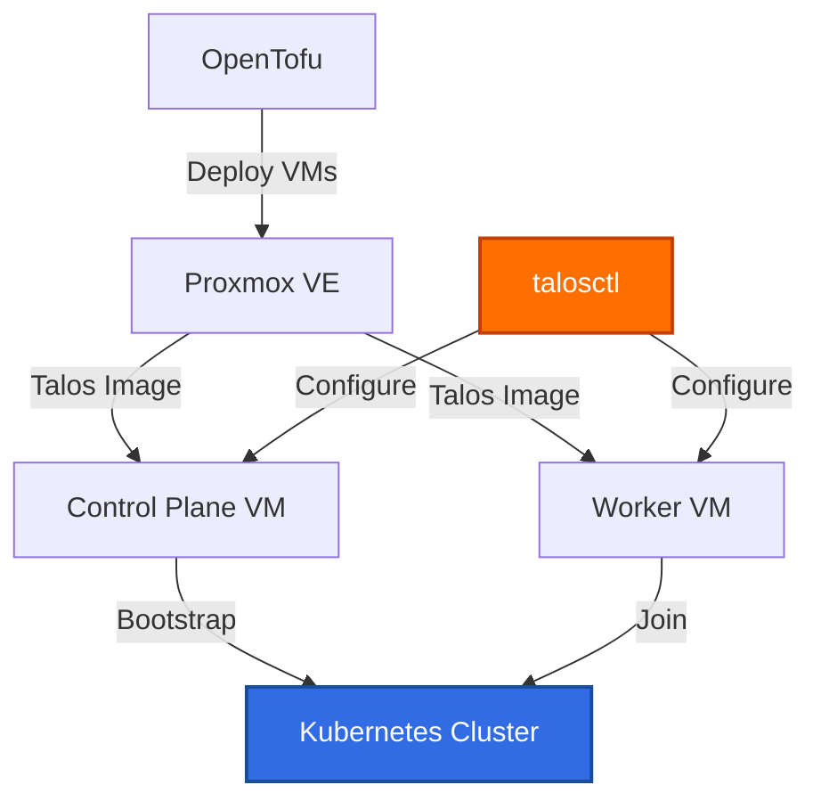

# Talos Linux

Talos Linux is a modern operating system designed specifically for running Kubernetes. It's API-managed, immutable, and minimal.

## Overview

Talos provides a secure, production-grade Kubernetes platform:

- **Immutable Infrastructure**: No SSH, no shell, API-only management
- **Minimal Attack Surface**: Purpose-built for Kubernetes only
- **Declarative Configuration**: Machine config as code
- **Production Ready**: Security hardened out of the box

## Why Talos?

Traditional Kubernetes distributions require managing the underlying OS, SSH access, package updates, and security hardening. Talos eliminates this complexity:

- **No SSH Access**: All management via API (talosctl)
- **Automated Updates**: Safe, atomic OS upgrades
- **CIS Hardened**: Security best practices by default
- **Immutable**: No configuration drift

## Architecture

## Deployment Workflow

1. **Image Factory**: Talos provides custom images with extensions
2. **OpenTofu**: Provisions VMs and downloads Talos image
3. **Machine Config**: Generated configs for control plane and workers
4. **Bootstrap**: Initialize Kubernetes cluster
5. **Kubeconfig**: Export credentials for kubectl access

## Cluster Components

Our Talos deployment includes:

- **Control Plane**: Single node running Kubernetes control plane
- **Worker Nodes**: Compute nodes for workloads
- **Network**: DHCP + static IP addressing
- **Extensions**: QEMU Guest Agent for Proxmox integration

## Configuration Management

Talos uses machine configuration patches defined in OpenTofu:

- **Hostname**: Per-node FQDN
- **Network**: Interface configuration with static IPs
- **Node Labels**: Topology and instance type labels
- **Cluster Settings**: API endpoint and certificates

## Next Steps

- [Deploy Cluster](deployment.md) - Step-by-step deployment guide
- [Configuration](configuration.md) - Customize machine configs
- [Maintenance](maintenance.md) - Upgrade and troubleshooting
